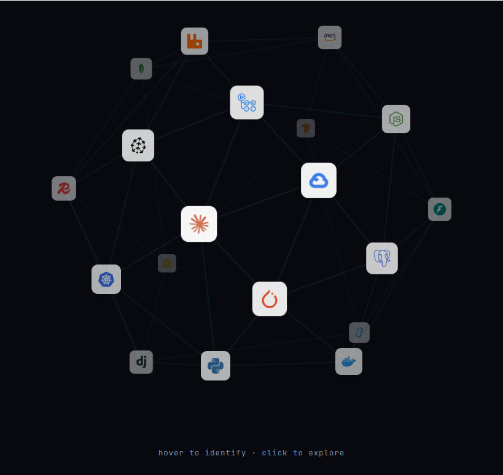

# TechStackGlobe

An interactive 3D globe for showcasing your tech stack. Icons auto-rotate on idle and spin to face the camera when clicked, revealing a detail panel with a description, rationale, and experience notes.



---

## Features

- Fibonacci sphere layout with K-NN edge graph rendered on a `<canvas>`
- Icons scale and fade with depth for a realistic 3D feel
- Spin-to-face animation on click (shortest-arc lerp, both axes)
- Slide-in detail panel with per-category accent colour
- Selection ring on the active icon
- Monogram fallback when a Simple Icons CDN logo is unavailable
- Light/dark theme awareness for edge opacity
- Fully responsive, reacts to container size changes

---

## Quick start

**1. Copy the folder into your project**

Drop the entire `TechStackGlobe/` folder into your project (e.g. alongside `src/`).

**2. Install the peer dependency**

```bash
npm install framer-motion
```

**3. Create your data file**

Create a file like `src/data/techItems.ts` and export an array of items:

```ts
import type { TechItem } from './TechStackGlobe/src';

export const techItems: TechItem[] = [
  {
    name: 'PostgreSQL',
    category: 'Databases',
    slug: 'postgresql',
    description: 'Open-source relational database.',
  },
  // add more items...
];
```

See the [Data shape](#data-shape) section for all available fields.

**4. Render the component**

```tsx
import TechStackGlobe from './TechStackGlobe/src';
import { techItems } from './data/techItems';

export default function SkillsSection() {
  return (
    <section style={{ padding: '4rem 0' }}>
      <TechStackGlobe items={techItems} />
    </section>
  );
}
```

---

## Requirements

| Package | Version |
|---|---|
| `react` | >= 18 |
| `react-dom` | >= 18 |
| `framer-motion` | >= 10 |

### Framework

The components include `'use client'` directives and are written for **Next.js App Router**. They will also work in any React project that supports client-side rendering. If you are not using Next.js, delete the `'use client'` line at the top of `TechStackGlobe.tsx`, `GlobeCanvas.tsx`, and `InfoPanel.tsx`.

---

## Data shape

Each item in your `items` array must match the `TechItem` interface:

```ts
interface TechItem {
  name: string;          // Display name, e.g. "PostgreSQL"
  category: string;      // Used for accent colour, e.g. "Databases"
  slug: string;          // Simple Icons slug, e.g. "postgresql" (see Icons section)
  description: string;   // One-sentence description of the tool
  whyUsed?: string;      // Why this tool is chosen over alternatives (optional)
  myExperience?: string; // Prose summary of hands-on experience (optional)
}
```

`whyUsed` and `myExperience` are optional. When omitted, their rows are hidden in the panel. This lets you add items quickly without writing full copy yet.

The `myExperience` field is split into bullet-style entries on sentence boundaries (`. ` or `; `). Write it as a series of complete sentences for best results.

### Minimal item (required fields only)

```ts
{ name: 'Redis', category: 'Databases', slug: 'redis', description: 'In-memory data store.' }
```

### Full item

```ts
{
  name: 'Redis',
  category: 'Databases',
  slug: 'redis',
  description: 'In-memory key-value store used for caching and pub/sub messaging.',
  whyUsed: 'Sub-millisecond latency at scale without the overhead of a full database.',
  myExperience: 'Used as a session cache for a high-traffic SaaS app. Implemented pub/sub for real-time notifications.',
}
```

### Built-in categories

The four categories with accent colours out of the box are: `AI/ML`, `Backend`, `Cloud`, `Databases`. Use one of these as your `category` value, or add a custom category via the `categoryColors` prop (see [Customisation](#customisation-notes)).

---

## Icons

Each item needs a `slug` — the identifier Simple Icons uses for that logo.

**Finding the slug:**
1. Go to [simpleicons.org](https://simpleicons.org) and search for the tool
2. The slug is the lowercase name shown under the icon (e.g. `postgresql`, `nextdotjs`, `amazonaws`)
3. Use that value as the `slug` field in your item

The component builds the logo URL automatically:

```
slug: 'postgresql'  ->  https://cdn.simpleicons.org/postgresql
```

No API key or npm package required.

**When a logo is missing:** if the CDN has no entry for a slug, a two-letter monogram is shown instead (e.g. `AW` for AWS). Check the exact slug spelling on simpleicons.org first, as many tools have non-obvious slugs (`amazonaws`, `nextdotjs`, `dotnet`).

**Overriding with a local image:** supply a path via the `logoOverrides` prop on `<TechStackGlobe>`:

```tsx
logoOverrides={{
  amazonaws: '/images/logos/aws.svg',
  pinecone:  '/images/logos/pinecone.svg',
}}
```

---

## Usage

### All props

```tsx
<TechStackGlobe
  items={techItems}

  // Height of the globe + panel container in px. Default: 540
  height={600}

  // Override default category -> accent colour mapping.
  // Merged with defaults, so you only need to supply what you want to change.
  categoryColors={{
    'AI/ML':     '#a78bfa',
    'Backend':   '#34d399',
    'Cloud':     '#38bdf8',
    'Databases': '#fb923c',
  }}

  // Map specific slugs to local image paths (see Icons section above).
  logoOverrides={{
    amazonaws: '/images/logos/aws.svg',
  }}

  // Text shown below the globe when no item is selected.
  // Default: "hover to identify · click to explore"
  hintText="hover · click to learn more"
/>
```

---

## Customisation notes

### Adding new categories

The built-in categories are `AI/ML`, `Backend`, `Cloud`, and `Databases`. Pass additional category names via the `categoryColors` prop:

```tsx
categoryColors={{ 'DevOps': '#f97316', 'Mobile': '#e879f9' }}
```

### Theming light/dark mode

The canvas edge lines automatically adjust opacity based on a `data-theme="light"` attribute on `<html>`, or the `prefers-color-scheme` media query if that attribute is absent.

---

## CSS variables

The component reads the following CSS custom properties. Define them in your global stylesheet. Fallback values are baked in so the component renders without them, but they will look generic.

```css
:root {
  /* Backgrounds */
  --color-surface:    #141414;  /* info panel card background */
  --color-surface-2:  #1e1e1e;  /* tooltip background */

  /* Borders */
  --color-border:     #2a2a2a;

  /* Text */
  --color-text:       #f0f0f0;
  --color-text-muted: #666666;

  /* Accents - used as category colours */
  --color-accent:      #2dd4bf; /* AI/ML  (teal)   */
  --color-accent-blue: #60a5fa; /* Backend (blue)  */
  --color-green:       #4ade80; /* Cloud  (green)  */
  --color-amber:       #fbbf24; /* Databases (amber) */

  /* Typography */
  --font-mono:    'JetBrains Mono', monospace;
  --font-display: 'Mona Sans', sans-serif;
  --font-body:    'DM Sans', sans-serif;
}
```

---

## File structure

```
TechStackGlobe/
  src/
    TechStackGlobe.tsx   Main exported component. Owns all state.
    GlobeCanvas.tsx      Canvas renderer + icon overlay + mouse/click handling.
    InfoPanel.tsx        Slide-in detail panel with logo, description, and experience.
    skill-logo.ts        getLogoSrc() and getMonogram() utilities.
    types.ts             TechItem interface and DEFAULT_CATEGORY_COLORS constant.
    index.ts             Entry point.
  package.json
  README.md
```

---

## License

MIT
